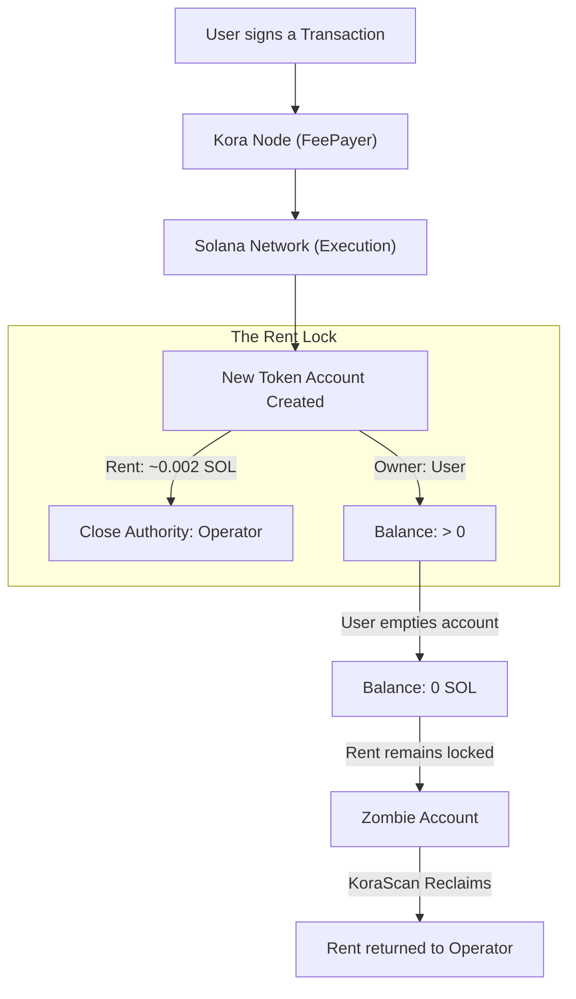

# How Kora Sponsorship Works

Kora is Solana's **signing infrastructure** that enables gasless transactions. When a dApp uses Kora, the operator's node acts as the `feePayer`, covering transaction fees and rent for the end user.

---

## The Lifecycle of a Sponsored Account

The diagram below illustrates how rent becomes "locked" in the Kora ecosystem and why KoraScan is necessary to recover it.

### 1. The Transaction Sponsorship
When a user performs an action (like minting an NFT or swapping a token), they often need an **Associated Token Account (ATA)**. Kora sponsors this process by paying the required **Rent Deposit** (approx. 0.002 SOL per account).

### 2. The Permission Structure
To protect the operator's investment, every sponsored account is created with:
- **Owner**: The end user (they control the tokens).
- **Close Authority**: The operator wallet (they control the rent reclamation).

### 3. The "Zombie" State
Once the user completes their action and transfers or sells their tokens, the account balance drops to **zero**. However, the account remains on-chain because it still contains the rent deposit. These are "Zombie Accounts" — wasted capital that is no longer serving a purpose.

### 4. The Reclamation
KoraScan identifies these zombie accounts by scanning the operator's lifetime transaction history. Once confirmed as empty and owned by the operator, KoraScan safely closes the account and returns the 0.002 SOL to the operator's treasury.

---

## Why KoraScan?

Without KoraScan, an operator effectively "leaks" SOL for every new user they onboard. For high-volume dApps, this can scale to **hundreds of SOL** trapped on-chain every month.

- **Automated**: No manual tracking required.
- **Universal**: Works with any RPC provider.
- **Safe**: Multi-layered verification ensures no active accounts are ever touched.
